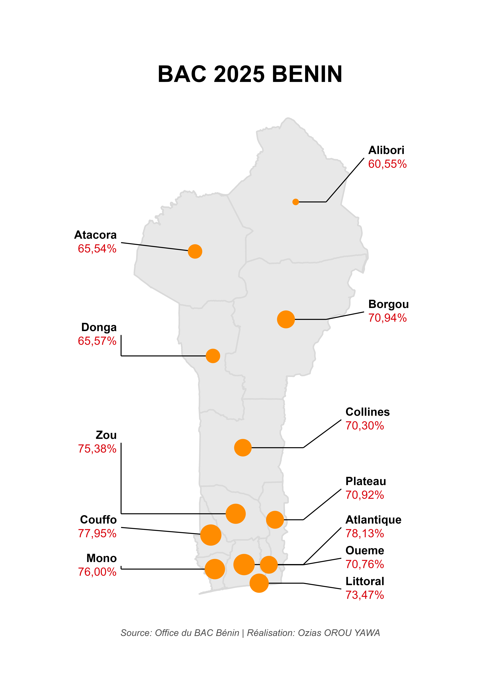

# Mapping 2025 BAC Results in Benin 🇧🇯

This repository contains an R script that generates a thematic map of the 2025 Baccalauréat success rates across the 12 departments of Benin. 

The approach uses GADM spatial data and manual label positioning to optimize the map's readability.

## Result

## R Packages Used
* `ggplot2`: Data visualization and styling
* `sf`: Spatial data manipulation and processing
* `geodata`: Automatic downloading of administrative boundaries
* `dplyr`: Database manipulation and joining
* `ggtext`: Rich text formatting (HTML/CSS) directly on the map

## How to Use
1. Clone this repository or download the `script_carte_bac.R` file.
2. Ensure you have an active internet connection during the first run (the `geodata` package will download the Benin base map).
3. Run the script in RStudio. The plot will display and automatically save as an A5 JPG file in your working directory.

## Author
**Ozias OROU YAWA** 
*Ecologist & Geographer | Geographic Information Systems Specialist*
